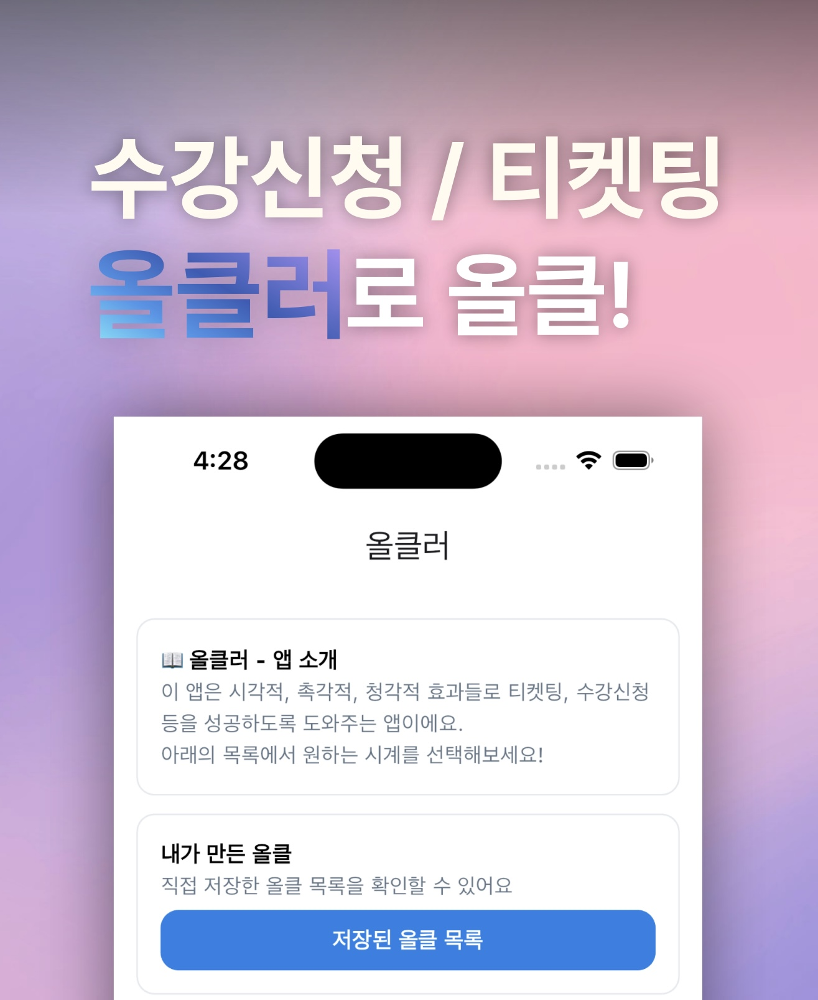
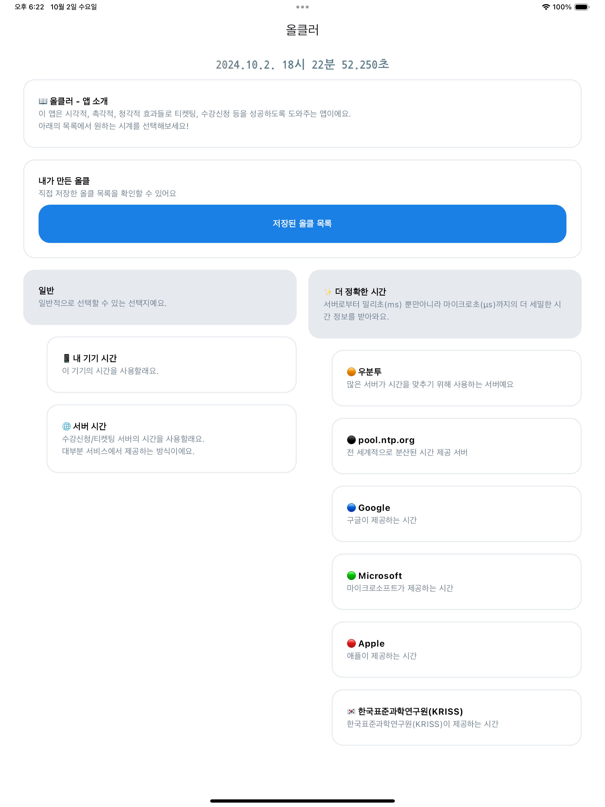
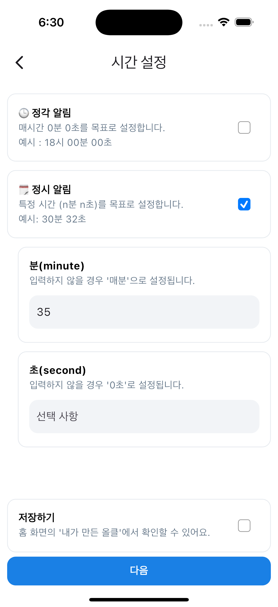
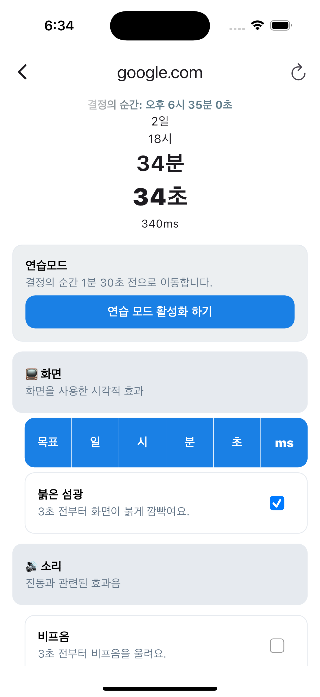
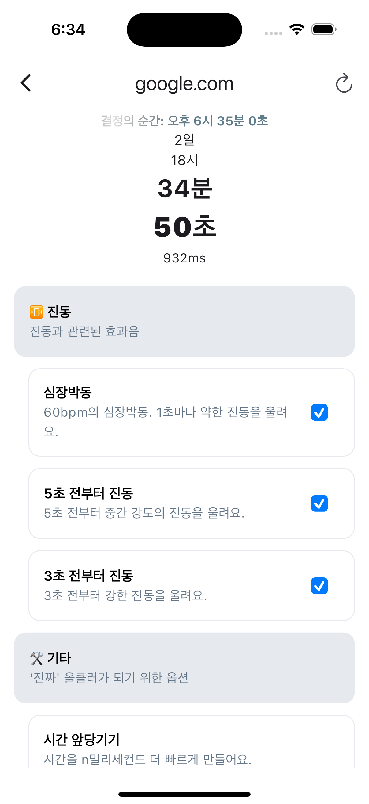
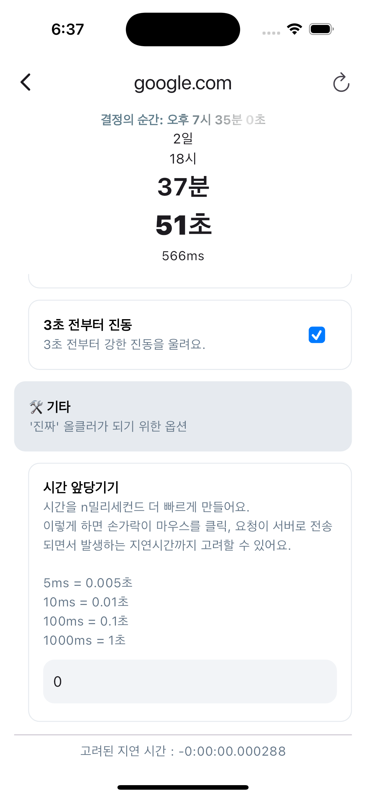

# 올클러  

  

티켓팅 / 수강신청을 위한 최고의 선택

  

## 특징    
  
이 앱은 티켓팅 및 수강신청을 위해 가능한 정확한 서버 시간을 제공합니다.  

### 기기 시간 및 NTP 서버까지  
서버 시간 외에도 사용자는 기기 시간과 NTP 서버를 선택할 수 있습니다.  
NTP 서버를 선택하여 ms 단위까지 더욱 세밀한 순발력을 발휘할 수 있습니다.  

  

### 이제는 정시 알림까지  
티켓팅 / 수강신청이 정각이 아니더라도 문제 없죠

  

### 수많은 맞춤 설정  
시각, 촉각, 청각 모든 감각을 사용하여 0.0001 초의 순간을 포착할 수 있습니다.

  

### 내 반응 속도 반영하기  
'시간 앞당기기' 설정을 사용하여 실제보다 0 ~ 1000ms 더 빠르게 시간을 조정할 수 있습니다.  

## 개발 현황  
### 군 생활 중  
- [x] 화면 켜짐 유지 기능 추가  
### 전역 후  
- [ ] 화면 켜짐 유지 작동 여부 확인